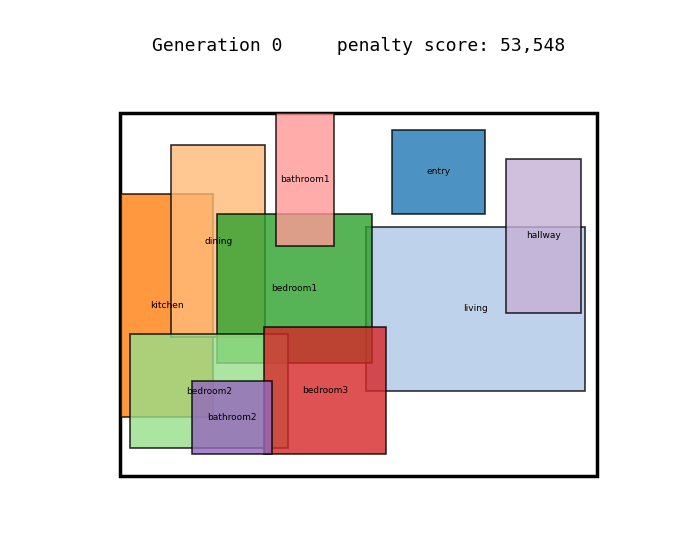
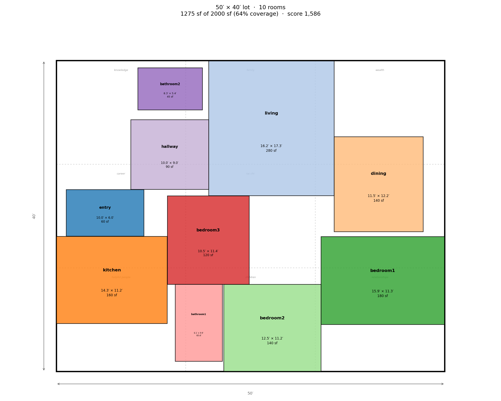

# Generative Floor Plan Optimizer


A genetic algorithm that evolves 2D residential floor plans inside a fixed
building envelope, scored against daylighting, circulation, adjacency, egress,
and code-minimum room dimension objectives.



400 generations, sampled every 4. The layout starts as random overlapping
rectangles and organizes itself — no floor plan was programmed in, only a
scoring function describing what a good one looks like.


**Left:** the best layout from a random starting population — rooms overlapping,
no organization. **Right:** the same problem after 400 generations of evolution.
Zero overlap, kitchen beside dining, bedrooms on the perimeter for daylight and
away from the entry, a compact circulation core.

Total penalty score drops from **53,548 to 477**, with overlap, out-of-bounds,
daylighting, separation, and egress all driven to exactly zero.


---

## Running it

```bash
pip install -r requirements.txt
python main.py
```

Prints an itemized fitness breakdown for generation 0 vs. the final evolved
layout, and regenerates the figures above.

To verify the whole pipeline without waiting for a full optimization:

```bash
python smoke_test.py
```

54 checks across the program, spec parser, genome, fitness, feng shui rules,
GA, and visualization layers. Runs in about two seconds. This is what CI
executes on every push, across Python 3.10, 3.11, and 3.12.

To regenerate the animation:

```bash
python make_animation.py
```

---

## Structure

```
main.py           # Entry point: runs the GA, prints scores, saves figures
smoke_test.py     # Fast end-to-end verification (what CI runs)
make_animation.py # Renders evolution.gif from a recorded run
house.txt         # The house description — edit this, not the code

floorplan/
  program.py      # Spec parser: reads house.txt into rooms + envelope
  genome.py       # Encoding: 3 genes per room -> placed rectangles
  fitness.py      # Multi-objective scoring (weighted-sum penalties)
  feng_shui.py    # Optional feng shui rule set (off by default)
  ga.py           # DEAP genetic algorithm loop
  visualize.py    # matplotlib rendering

examples/
  house_dimensions.txt  # Same house, rooms given as dimensions
  house_fengshui.txt    # Feng shui enabled, roomier lot

.github/workflows/
  ci.yml                  # Runs smoke_test.py on every push
  design.yml              # Form: enter a house, get a plan back
  regenerate-figures.yml  # Manual trigger: full run, commits updated figures
```

---

## Describing a house

The house lives in `house.txt`, not in code:

```
lot 42 x 32

living     280  exterior min=12
kitchen    160  exterior min=10
entry      60   exterior entry min=6
```

Room size accepts two forms:

| Written as | Means |
|---|---|
| `living 280` | 280 sq ft — the optimizer picks the proportions |
| `living 14x20` | Exactly 14 by 20 feet — locked |

With locked dimensions the optimizer can still rotate a room 90° and move it,
but never resize it. Flags after the size: `exterior` (needs an outside wall),
`entry` (the front door — exactly one room must have it), and `min=N` (smallest
allowed width or height).

Locked rooms pack much harder than flexible ones. Past roughly 85% coverage
they usually can't fit without overlapping, and the parser warns when a spec
crosses that line.

You can also skip the file entirely: **Actions → Design a floor plan** gives you
a form. Enter a lot size and rooms, and the finished plan appears on the run
summary page and lands in `designs/`.

---

## How the genome works

Each room gets **three genes**, all floats in `[0, 1]`:

| Gene | Meaning |
|---|---|
| `x`, `y` | Corner position, as a fraction of the envelope's usable width/height |
| `aspect` | Maps log-uniformly to a width/height ratio in `[0.4, 2.5]` |

Room **area is fixed** by the program (e.g. "bedroom1: 180 sqft"), so aspect
ratio alone determines both dimensions:

```
w = sqrt(area × ratio)
h = sqrt(area ÷ ratio)
```

This matters: the GA can never cheat by shrinking a room to dodge an overlap
penalty. Area is a hard constraint baked into decoding, not something the
optimizer controls. Positions are expressed as fractions rather than absolute
feet so that crossover and mutation stay well-behaved regardless of how large
the envelope is.

When a room is given explicit dimensions instead of an area, the third gene
switches meaning: it becomes a 90° rotation flag rather than an aspect ratio.
The room can turn, but not resize.

---

## Fitness terms

All terms are **penalties** — lower is better. The GA minimizes their weighted sum.

| Term | What it measures |
|---|---|
| `overlap` | Total intersection area between any two rooms |
| `out_of_bounds` | Room area falling outside the building envelope |
| `min_dim` | Rooms thinner than their code-minimum width or height |
| `adjacency` | Distance between room pairs that should be close (kitchen↔dining, hall↔bedrooms) |
| `separation` | Rooms that should be apart but aren't (bedrooms↔entry) |
| `daylight` | Exterior-facing rooms that fail to touch an outside wall |
| `circulation` | Uncovered floor area inside the envelope, beyond the dedicated hallway |
| `egress` | Distance from each room to the entry, penalized past 40 ft |

Weights live at the top of `fitness.py`. Raising `W_ADJACENCY` relative to
`W_DAYLIGHT`, for example, visibly changes what kind of layouts the GA
converges toward — a useful thing to demonstrate live.

Enabling feng shui adds six more terms on top of these.

---

## Feng shui mode

An optional second rule set, encoding traditional feng shui principles as
geometry. These are cultural design conventions, not empirical performance
criteria — they're implemented because "the client wants feng shui
compliance" is a real constraint an architect gets handed, and because the
rules turn out to be unusually well suited to this solver: nearly all of them
reduce to adjacency, orientation, or sightline conditions the fitness
function can already express.

Turn it on with a line in the spec file:

```
fengshui on
```

or tick the checkbox on the workflow form.



The dashed 3×3 overlay is the bagua grid. It uses the Black Sect (BTB) form,
which orients to the **front door** rather than compass north — so the rules
stay meaningful without knowing which way the lot faces. Entry on the west
wall reorients the whole grid automatically.

| Rule | What it checks |
|---|---|
| `chi_straight_shot` | Casts a ray inward from the front door; penalizes an unobstructed run across the house |
| `bathroom_at_entry` | Bathroom shouldn't be the first thing facing the door |
| `kitchen_bath_clash` | Shared wall length between kitchen and bathroom (the fire/water clash) |
| `bathroom_center` | Nothing wet in the tai chi — the middle ninth of the plan |
| `bedroom_command` | Bedrooms out of the door's direct line of travel |
| `bagua_zones` | Preferred and disfavored octants for key rooms |

Several of these have a straightforwardly practical reading alongside the
traditional one. The straight-shot rule is the clearest: the traditional
objection is that chi enters and immediately escapes, while the practical
objection is identical in shape — an unobstructed axis from the front door
means no privacy buffer and nothing to slow air or sound.

### Feng shui compliance costs floor area

The rules can't always be satisfied. On a tight plan there's simply nowhere to
put a bathroom except the center. Running the same ten-room program on three
lot sizes:

| Lot | Coverage | Feng shui penalty |
|---|---|---|
| 42 × 32 | 95% | 139 |
| 46 × 36 | 77% | 3 |
| 50 × 40 | 64% | **−24** |

A negative score means the optimizer didn't just avoid the disfavored
placements, it hit the preferred ones — master bedroom in the relationships
zone, living room in family. So compliance needs roughly 20% slack in the
plan, which is a measured tradeoff rather than an assertion.

With feng shui disabled, scoring is unchanged: the default house still returns
exactly 477.07 at seed 7, the same as before the feature existed.

---

## Tuning notes

**Hard constraints need disproportionate weight.** With the overlap penalty at
its initial value, the GA converged to a layout with roughly 300 sqft of
residual room overlap — the softer objectives were effectively out-negotiating
the hard constraint, accepting a bit of overlap in exchange for better
adjacency. Tripling `W_OVERLAP` and `W_OUT_OF_BOUNDS`, then running longer with
a smaller mutation step, drove overlap to exactly zero. This is the classic
weighted-sum pitfall: a constraint that isn't weighted heavily enough stops
being a constraint.

**Elitism prevents regression.** Without carrying the single best individual
through unchanged each generation, the best score occasionally got *worse*
between generations as crossover and mutation destroyed good solutions. One
elite slot fixed it.

**Mutation step size controls the endgame.** A larger step (`sigma=0.15`)
explored well early but couldn't settle into a clean packing. Dropping to
`sigma=0.10` and running more generations let the population fine-tune room
positions once the rough arrangement was found.

**Normalize penalties that scale with area.** The tai chi rule originally
returned raw square feet, which meant its weight implied something different
on a 1,300 sf cottage than on a 6,000 sf house. Expressing it as a fraction of
each bathroom's own area made the weight portable across house sizes.

---

## Where this goes next

Roughly in order of how much each would strengthen the project:

1. **True multi-objective optimization.** Replace the weighted-sum DEAP setup
   with `pymoo`'s NSGA-II, returning the itemized tuple from
   `score_breakdown()` instead of a single sum. This produces a **Pareto
   front** — an explicit daylight-vs-circulation tradeoff curve — rather than
   one blended number. The single biggest upgrade, since real design work is
   about navigating tradeoffs, not optimizing a scalar.

2. **Egress as a real path.** Currently `_egress_penalty` uses straight-line
   distance to the entry, which ignores walls. A more honest version would
   rasterize the plan and run a grid-based BFS or A* around obstacles, or
   build a doorway-connectivity graph and compute shortest paths.

3. **Doors and openings.** Rooms are sealed rectangles with no connectivity
   model. Adding doorways would let adjacency scoring reward *actual access*
   rather than mere proximity, and would make real egress pathing meaningful.

4. **Non-rectangular lots.** `ENVELOPE` is an axis-aligned rectangle. Shapely
   already supports arbitrary polygons, so an irregular lot with real zoning
   setbacks is a contained change to `program.py` and the bounds checks.

5. **Diffusion model on RPLAN.** The genome/decode split should make this
   swap fairly self-contained — replace `ga.run()` with a sampler that emits
   the same flat genome format, and `fitness.py` and `visualize.py` need no
   changes at all.

---

## Stack

Python · [DEAP](https://github.com/DEAP/deap) (genetic algorithm) ·
[Shapely](https://shapely.readthedocs.io/) (geometry and overlap detection) ·
Matplotlib (visualization)
