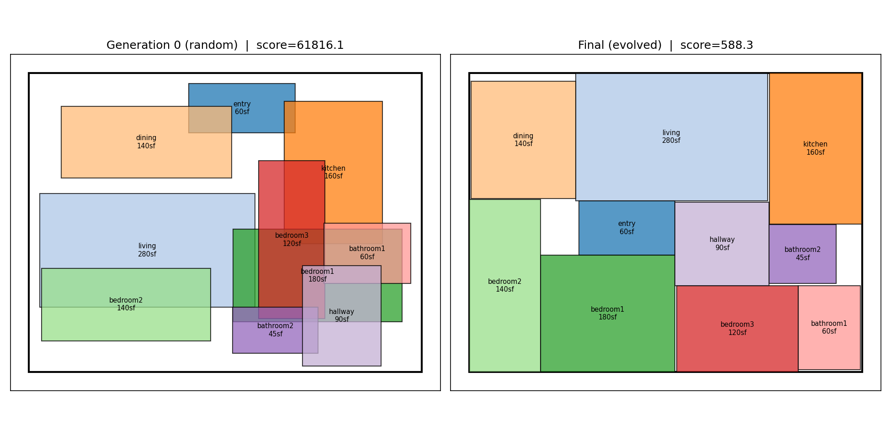
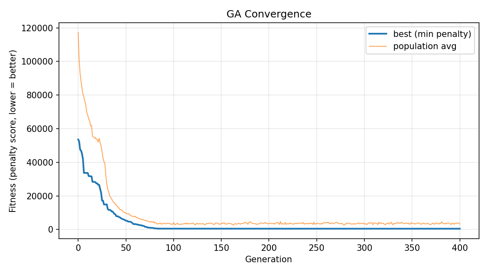

# Generative Floor Plan Optimizer


A genetic algorithm that evolves 2D residential floor plans inside a fixed
building envelope, scored against daylighting, circulation, adjacency, egress,
and code-minimum room dimension objectives.



**Left:** the best layout from a random starting population — rooms overlapping,
no organization. **Right:** the same problem after 400 generations of evolution.
Zero overlap, kitchen beside dining, bedrooms on the perimeter for daylight and
away from the entry, a compact circulation core.

Total penalty score drops from **53,548 to 477**, with overlap, out-of-bounds,
daylighting, separation, and egress all driven to exactly zero.



---

## Running it

```bash
pip install -r requirements.txt
python main.py
```

Prints an itemized fitness breakdown for generation 0 vs. the final evolved
layout, and regenerates both figures above.

To verify the whole pipeline without waiting for a full optimization:

```bash
python smoke_test.py
```

18 checks across the program, genome, fitness, GA, and visualization layers.
Runs in about two seconds. This is what CI executes on every push, across
Python 3.10, 3.11, and 3.12.

---

## Structure

```
main.py           # Entry point: runs the GA, prints scores, saves figures
smoke_test.py     # Fast end-to-end verification (what CI runs)

floorplan/
  program.py      # The lot envelope + room program — edit this to change the house
  genome.py       # Encoding: 3 genes per room -> placed rectangles
  fitness.py      # Multi-objective scoring (weighted-sum penalties)
  ga.py           # DEAP genetic algorithm loop
  visualize.py    # matplotlib rendering

.github/workflows/
  ci.yml                  # Runs smoke_test.py on every push
  regenerate-figures.yml  # Manual trigger: full run, commits updated figures
```

---

## How the genome works

Each room gets **three genes**, all floats in `[0, 1]`:

| Gene | Meaning |
|---|---|
| `x`, `y` | Corner position, as a fraction of the envelope's usable width/height |
| `aspect` | Maps log-uniformly to a width/height ratio in `[0.4, 2.5]` |

Room **area is fixed** by the program (e.g. "bedroom1: 180 sqft"), so aspect
ratio alone determines both dimensions:

```
w = sqrt(area × ratio)
h = sqrt(area ÷ ratio)
```

This matters: the GA can never cheat by shrinking a room to dodge an overlap
penalty. Area is a hard constraint baked into decoding, not something the
optimizer controls. Positions are expressed as fractions rather than absolute
feet so that crossover and mutation stay well-behaved regardless of how large
the envelope is.

---

## Fitness terms

All terms are **penalties** — lower is better. The GA minimizes their weighted sum.

| Term | What it measures |
|---|---|
| `overlap` | Total intersection area between any two rooms |
| `out_of_bounds` | Room area falling outside the building envelope |
| `min_dim` | Rooms thinner than their code-minimum width or height |
| `adjacency` | Distance between room pairs that should be close (kitchen↔dining, hall↔bedrooms) |
| `separation` | Rooms that should be apart but aren't (bedrooms↔entry) |
| `daylight` | Exterior-facing rooms that fail to touch an outside wall |
| `circulation` | Uncovered floor area inside the envelope, beyond the dedicated hallway |
| `egress` | Distance from each room to the entry, penalized past 40 ft |

Weights live at the top of `fitness.py`. Raising `W_ADJACENCY` relative to
`W_DAYLIGHT`, for example, visibly changes what kind of layouts the GA
converges toward — a useful thing to demonstrate live.

---

## Tuning notes

**Hard constraints need disproportionate weight.** With the overlap penalty at
its initial value, the GA converged to a layout with roughly 300 sqft of
residual room overlap — the softer objectives were effectively out-negotiating
the hard constraint, accepting a bit of overlap in exchange for better
adjacency. Tripling `W_OVERLAP` and `W_OUT_OF_BOUNDS`, then running longer with
a smaller mutation step, drove overlap to exactly zero. This is the classic
weighted-sum pitfall: a constraint that isn't weighted heavily enough stops
being a constraint.

**Elitism prevents regression.** Without carrying the single best individual
through unchanged each generation, the best score occasionally got *worse*
between generations as crossover and mutation destroyed good solutions. One
elite slot fixed it.

**Mutation step size controls the endgame.** A larger step (`sigma=0.15`)
explored well early but couldn't settle into a clean packing. Dropping to
`sigma=0.10` and running more generations let the population fine-tune room
positions once the rough arrangement was found.

---

## Where this goes next

Roughly in order of how much each would strengthen the project:

1. **True multi-objective optimization.** Replace the weighted-sum DEAP setup
   with `pymoo`'s NSGA-II, returning the itemized tuple from
   `score_breakdown()` instead of a single sum. This produces a **Pareto
   front** — an explicit daylight-vs-circulation tradeoff curve — rather than
   one blended number. The single biggest upgrade, since real design work is
   about navigating tradeoffs, not optimizing a scalar.

2. **Egress as a real path.** Currently `_egress_penalty` uses straight-line
   distance to the entry, which ignores walls. A more honest version would
   rasterize the plan and run a grid-based BFS or A* around obstacles, or
   build a doorway-connectivity graph and compute shortest paths.

3. **Doors and openings.** Rooms are sealed rectangles with no connectivity
   model. Adding doorways would let adjacency scoring reward *actual access*
   rather than mere proximity, and would make real egress pathing meaningful.

4. **Non-rectangular lots.** `ENVELOPE` is an axis-aligned rectangle. Shapely
   already supports arbitrary polygons, so an irregular lot with real zoning
   setbacks is a contained change to `program.py` and the bounds checks.

5. **Diffusion model on RPLAN.** The genome/decode split should make this
   swap fairly self-contained — replace `ga.run()` with a sampler that emits
   the same flat genome format, and `fitness.py` and `visualize.py` need no
   changes at all.

---

## Stack

Python · [DEAP](https://github.com/DEAP/deap) (genetic algorithm) ·
[Shapely](https://shapely.readthedocs.io/) (geometry and overlap detection) ·
Matplotlib (visualization)
